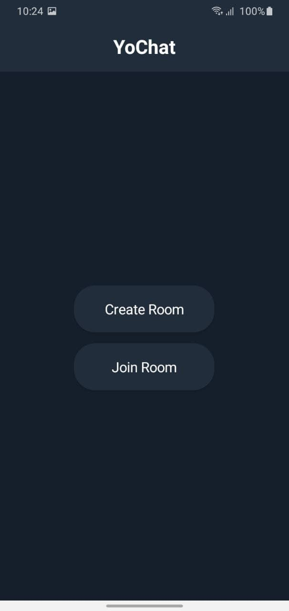

# YoChat - Your daily messaging app
 

 
 

YoChat is your daily messaging app. it works in a way of creating and joining room. You can create room, invite your friends to the room and you can start enjoying!
What are you waiting for? Install it now and start enjoying it!!

 
 

# Appearance
<b>

 
    
    
    

    
    
    

 

# Features
1. It works in a way of creating and joining room
2. It has two themes mode. dark and light theme and it can detect your current theme mode.
3. Closing room you created

# Upcoming features
1. Voice mail
2. File sending
3. Voice call
4. Video call

# Release

To download the app checkout the  playstore link that is _________

# Contribution

I am welcome to anyone who wants to contribute to this project. Especially on the above listed *Upcoming features*
